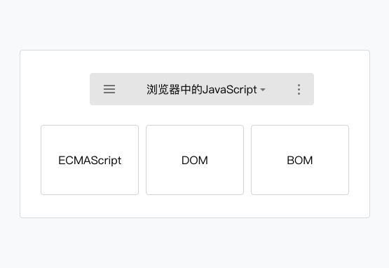
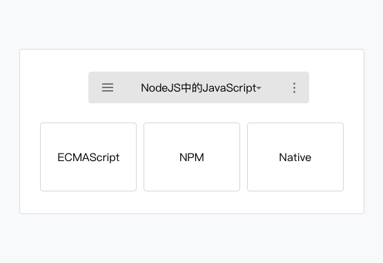

# ECMAScript
在大部分开发者看来，ECMAScript和JavaScript表达的是同一种含义，但是严格的说，两者的意义是不同的。ECMAScript是一种由Ecma国际通过ECMA-262标准化的脚本程序设计语言， JavaScript 是 ECMAScript 的一种实现。理解 JavaScript 是 ECMAScript 一种实现后，可以帮助开发者理解小程序中的 JavaScript同浏览器中的 JavaScript 以及 NodeJS 中的 JavaScript 是不相同的。

### ECMA-262 规定了 ECMAScript 语言的几个重要组成部分：  
1. 语法
2. 类型 
3. 语句
4. 关键字
5. 对象

### 不同环境下的JavaScript
- 浏览器中的JavaScript 是由 ECMAScript 和 BOM（浏览器对象模型）以及 DOM（文档对象模型）组成的，Web前端开发者会很熟悉这两个对象模型，它使得开发者可以去操作浏览器的一些表现，比如修改URL、修改页面呈现、记录数据等等。

- NodeJS中的JavaScript 是由 ECMAScript 和 NPM以及Native模块组成，NodeJS的开发者会非常熟悉 NPM 的包管理系统，通过各种拓展包来快速的实现一些功能，同时通过使用一些原生的模块例如 FS、HTTP、OS等等来拥有一些语言本身所不具有的能力。

- 小程序中的 JavaScript 是由ECMAScript 以及小程序框架和小程序 API 来实现的。同浏览器中的JavaScript 相比没有 BOM 以及 DOM 对象，所以类似 JQuery、Zepto这种浏览器类库是无法在小程序中运行起来的，同样的缺少 Native 模块和NPM包管理的机制，小程序中无法加载原生库，也无法直接使用大部分的 NPM 包。


# 小程序的执行环境

### 小程序目前可以运行在三大平台，不同的平台实现的 ECMAScript 的标准有所不同：
- iOS平台，包括iOS9、iOS10、iOS11
- Android平台
- 小程序IDE
  > iOS9和iOS10 所使用的运行环境并没有完全的兼容到 ECMAScript 6 标准。开发者需要在项目设置中，勾选 ES6 转 ES5 开启此功能。


# 作用域
小程序的脚本的作用域同 `NodeJS` 相似。
- 在文件中声明的变量和函数只在该文件中有效，不同的文件中可以声明相同名字的变量和函数，不会互相影响。
- 当需要使用全局变量的时，通过使用全局函数 `getApp()` 获取全局的实例，并设置相关属性值，来达到设置全局变量的目的。
  > ```js
  > // 获取 global 变量
  > var app = getApp()
  > // 修改 global 变量
  > app.globalData = 'foo' 
  >```


# 模块化
```js
// moduleA.js
module.exports = function( value ){
  return value * 2;
}

// B.js
var multiplyBy2 = require('./moduleA')
var result = multiplyBy2(4)
```

```js
// index.js
var common = require('common.js')
Page({
  helloMINA: function() {
    common.sayHello('MINA')
  },
  goodbyeMINA: function() {
    common.sayGoodbye('MINA')
  }
})
```

# 脚本的执行顺序
 _浏览器中，脚本严格按照加载的顺序执行_  
 ___小程序中，根据入口文件`app.js`来确定执行顺序。当 app.js 执行结束后，小程序会按照开发者在 app.json 中定义的 pages 的顺序，逐一执行___


